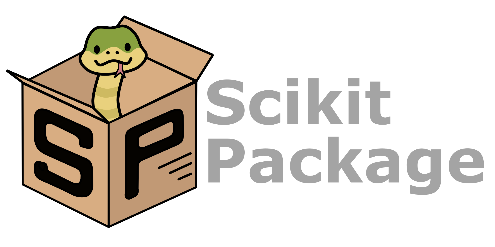

:tocdepth: -1

.. index:: getting-started

.. _getting-started:

================
Getting started
================

Here are some example templates provided to help you get started with writing your documentation. You can use these templates to create your own documentation.

Reuse ``.rst`` files across multiple pages
------------------------------------------

Here is how you can reuse a reusable block of ``.rst`` files across multiple pages:

.. include:: snippets/example-table.rst

.. warning::

    Ensure that the ``.rst`` file you are including is not too long. If it is too long, it may be better to split it into multiple files and include them separately.

Refer to a specific section in the documentation
------------------------------------------------

You can use the ``ref`` tag to refer to a specific section in the documentation. For example, you can refer to the section below using the ``:ref:`` tag as shown :ref:`here <attach-image>`.

.. note::

    Please check the raw ``.rst`` file of this page to see the exact use of the ``:ref:`` tag.

Embed your code snippets in the documentation
---------------------------------------------

Here is how you can write a block of code in the documentation. You can use the ``code-block`` directive to write a block of code in the documentation. For example, you can write a block of code as shown below:

.. code-block:: bash

    # Create a new environment, without build dependencies (pure Python package)
    conda create -n <package_name>-env python=3.13 \
        --file requirements/test.txt \
        --file requirements/conda.txt

    # Create a new environment, with build dependencies (non-pure Python package)
    conda create -n <package_name>-env python=3.13 \
        --file requirements/test.txt \
        --file requirements/conda.txt \
        --file requirements/build.txt

    # Activate the environment
    conda activate <package_name>_env

    # Install your package locally
    # `--no-deps` to NOT install packages again from `requirements.pip.txt`
    pip install -e . --no-deps

    # Run pytest locally
    pytest

    # ... run example tutorials

.. _attach-image:

Attach an image to the documentation
------------------------------------

Here is how you attach an image to the documentation. The ``/doc/source/img/scikit-package-logo-text.png`` example image is provided in the template.

Other useful directives
-----------------------

Here is how you can do menu selection  :menuselection:`Admin --> Settings` and display labels for buttons like :guilabel:`Privacy level`.
